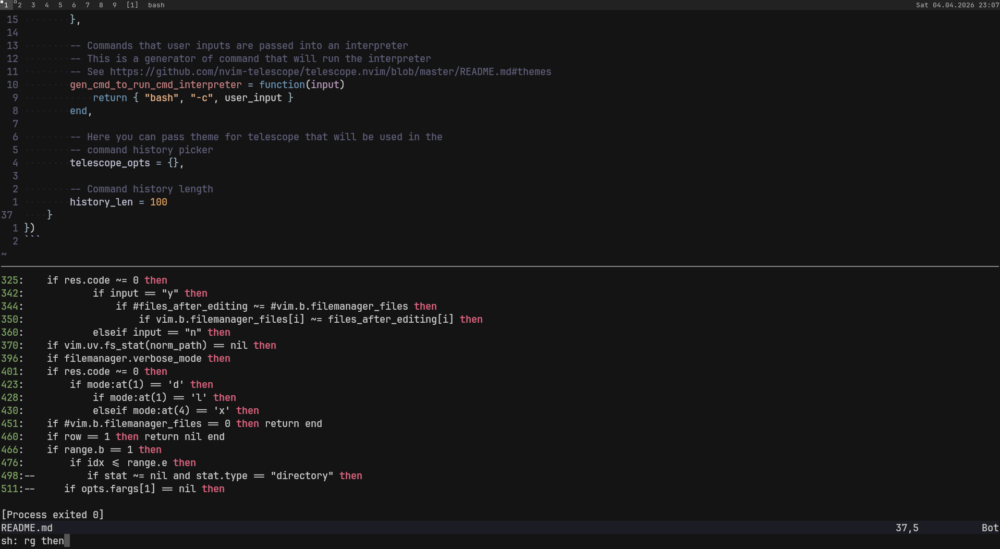
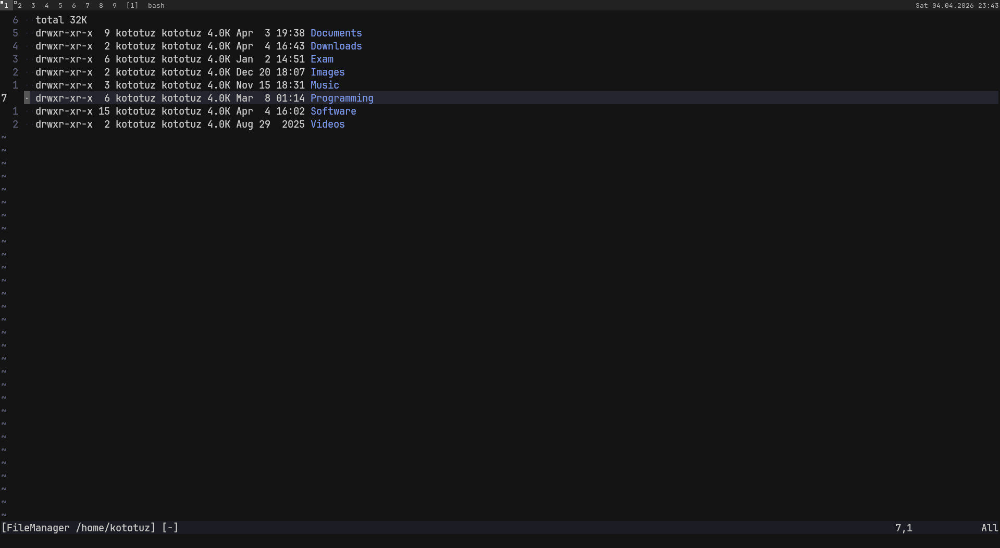

# simple.nvim

Collection of simple features that i think must be part
of neovim in some form


## Shell command

> [!WARNING]
> To get better expirience consider using Neovim v0.12

<p align=center>
  
</p>


This is like an [emacs compilation mode](https://www.gnu.org/software/emacs/manual/html_node/emacs/Compilation-Mode.html),
but without parsing error messages (maybe in the feature). Basically it works
ontop of neovim terminal buffers + `vim.fn.jobstart`. It is also has support
for searching history using [Telescope](https://github.com/nvim-telescope/telescope.nvim)

``` lua
require("simple").setup({
    shell_command = {
        disabled = false,

        keymaps = {
            input              = "<leader>;" -- Input and run command
            run_last           = "<leader>l" -- Run last command
            scroll_output_up   = "<C-k>"     -- Scroll output buffer up
            scroll_output_down = "<C-j>"     -- Scroll output buffer down
            search_history     = "<leader>h" -- Search command history using telescope
        },

        -- Commands that user inputs are passed into an interpreter
        -- This is a generator of command that will run the interpreter
        -- See https://github.com/nvim-telescope/telescope.nvim/blob/master/README.md#themes
        gen_cmd_to_run_cmd_interpreter = function(input)
            return { "bash", "-c", user_input }
        end,

        -- Here you can pass theme for telescope that will be used in the
        -- command history picker
        telescope_opts = {},

        -- Command history length
        history_len = 100
    }
})
```


## File Manager

<p align=center>
  
</p>

I've tried to combine speed of changing directories and convinient file name editing.
So the file manager has two modes - **explore** and **edit**. In the explore mode you
can jump between directories, open, delete, rename, copy and move files. The edit mode is
something like bulk rename in [ranger](https://github.com/ranger/ranger). Directory
content is rendered using `ls -l --dired + options` command (so it probably won't work
on Windows). Funny moment is that the `--dired` option is for
[Emacs' dired mode](https://www.gnu.org/software/emacs/manual/html_node/emacs/Dired.html).
We are using this option to highlight executables, directories, etc. and to
identify file names from output.

The file manager also integrates with Shell Command and Telescope and replaces the
default neovim netrw. You can run commands on selected files, run commands + find files +
grep strings with CWD set to the file manager directory

``` lua
require("simple").setup({
    file_manager = {
        disabled = false,

        keymaps = {
            telescope_find_files = "<leader>f", -- Find files with CWD set to the file manager buffer
            telescope_live_grep  = "<leader>/"  -- Grep string with CWD set to the file manager buffer
        },

        -- Additional options to `ls` command
        ls_opts = { "-h", "--group-directories-first" }

        -- Keymap to open file manager
        open = "<leader>p"
    }
})
```
